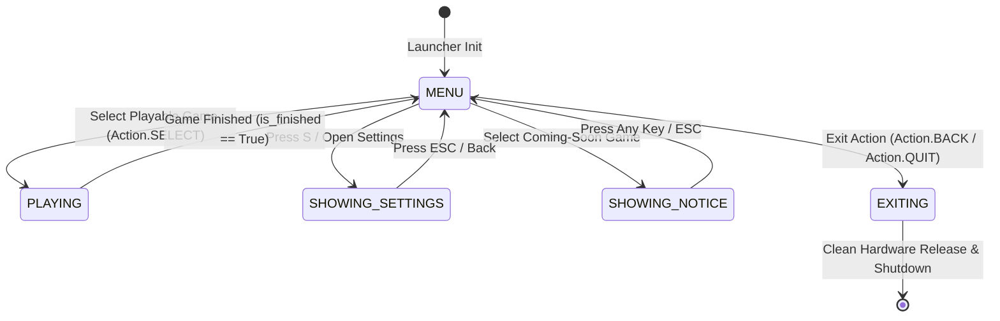

# System Architecture - Pi Arcade OS

## Technical Architecture Overview

**Pi Arcade OS** is structured around clean separation of concerns, decoupling physical hardware I/O management from top-level application orchestration and game logic execution.

---

## High-Level Component Diagram

```mermaid
graph TD
    SubMain["src/main.py (Entry Point)"] --> SubSave["SaveManager (src/save_manager.py)"]
    SubMain --> SubSettings["SettingsManager (src/settings_manager.py)"]
    SubMain --> SubInput["InputManager (src/hardware/input_manager.py)"]
    SubMain --> SubDisplay["DisplayManager (src/hardware/display.py)"]
    SubMain --> SubAudio["AudioManager (src/hardware/audio.py)"]
    SubMain --> SubDiag["SystemDiagnostics (src/hardware/diagnostics.py)"]
    SubMain --> SubRegistry["GameRegistry (src/game_registry.py)"]
    SubMain --> SubLauncher["Launcher (src/launcher.py)"]

    SubSave <-->|Atomic Save Persistence| SubSettings
    SubInput -->|Thread-Safe Action Queue| SubLauncher
    SubLauncher -->|Update LCD| SubDisplay
    SubLauncher -->|Play Tones| SubAudio

    SubLauncher -->|Lookup & Instantiate| SubRegistry
    SubRegistry -->|Manages Metadata & Classes| SubInterface["ArcadeGame Interface (src/game_interface.py)"]
    SubInterface <|.. SubSnake["SnakeGame (src/games/snake_game.py)"]
    SubInterface <|.. SubPong["PongGame (src/games/pong_game.py)"]
```

---

## Core Components Breakdown

### 1. Main Entry Point (`src/main.py`)
- Parses CLI arguments (`--gpio`, `--no-lcd`, `--no-audio`, `--diagnostics`).
- Initializes `SaveManager`, `SettingsManager`, and Pygame display context.
- Registers playable game classes (`SnakeGame`, `PongGame`) and preview metadata (`Tetris`, `Breakout`).
- Executes the primary 60 FPS update and render loop.
- Performs clean hardware shutdown on exit signals.

### 2. Persistence & Settings Subsystem (`src/`)
- **`SaveManager` (`src/save_manager.py`)**: Central atomic JSON save manager storing high scores, wins, losses, longest rallies, best survival times, total play time, and recent games. Uses temporary file creation and `os.replace` for power-interruption safety, and automatically recovers from backup files (`save_data.json.bak`).
- **`SettingsManager` (`src/settings_manager.py`)**: Manages master, music, and effects volume, LCD brightness, theme palette selection, difficulty level, and control mappings. Dispatches live listener callbacks.

### 3. Hardware Abstraction Layer (`src/hardware/`)
- **`InputManager`**: Normalizes keyboard keypresses and physical Raspberry Pi GPIO button presses into unified `Action` enums (`UP`, `DOWN`, `LEFT`, `RIGHT`, `SELECT`, `BACK`, `RESTART`, `QUIT`). Button callbacks push events to a thread-safe `queue.Queue`.
- **`DisplayManager`**: Encapsulates Pygame screen rendering alongside real-time updates to a physical 16x2 I2C LCD character display (`0x27`). Try-except isolated to prevent LCD hardware failures from crashing the system.
- **`AudioManager`**: Synthesizes non-blocking sound waves for desktop Pygame mixer audio and passive GPIO buzzer tones (BCM 12) across 15 distinct sound effect events.
- **`SystemDiagnostics`**: Gathers hardware subsystem status, platform details, Python/Pygame versions, screen specs, and registered game statistics into formatted reports.

### 4. Engine & Game Registry (`src/`)
- **`ArcadeGame` Interface (`src/game_interface.py`)**: Abstract base class enforcing properties (`name`, `description`, `is_finished`, metadata getters) and lifecycle methods (`start()`, `handle_event()`, `update()`, `draw()`, `reset()`, `cleanup()`).
- **`GameRegistry` (`src/game_registry.py`)**: Central registry managing `GameMetadata` dataclass instances and `ArcadeGame` classes. Supports previewing coming-soon titles safely without instantiating unwritten code.
- **`Launcher` (`src/launcher.py`)**: Top-level state machine (`MENU`, `PLAYING`, `SHOWING_NOTICE`, `SHOWING_SETTINGS`, `EXITING`). Renders animated menu cursor (`>`), glowing title banner, particle background, selection cards, hardware badges, and modal overlays.

---

## State Machine Transition Diagram


